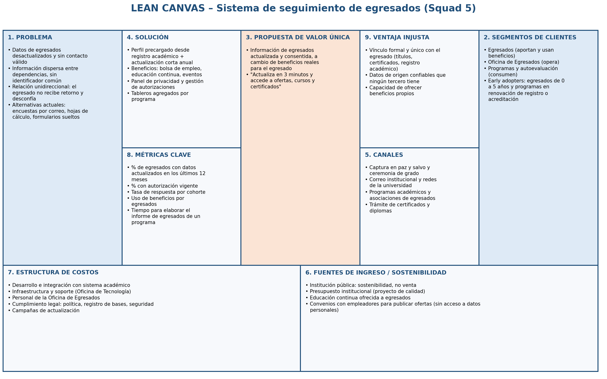

# Decisiones sobre el Lean Canvas

## Bloques
**1. Problema:** Datos de egresados desactualizados y sin contacto válido; Información dispersa entre dependencias, sin identificador común; Relación unidireccional: el egresado no recibe retorno y desconfía; Alternativas actuales: encuestas por correo, hojas de cálculo, formularios sueltos

**2. Segmentos:** Egresados (aportan y usan beneficios); Oficina de Egresados (opera); Programas y autoevaluación (consumen); Early adopters: egresados de 0 a 5 años y programas en renovación de registro o acreditación

**3. Propuesta de valor:** Información de egresados actualizada y consentida, a cambio de beneficios reales para el egresado; "Actualiza en 3 minutos y accede a ofertas, cursos y certificados"

**4. Solución:** Perfil precargado desde registro académico + actualización corta anual; Beneficios: bolsa de empleo, educación continua, eventos; Panel de privacidad y gestión de autorizaciones; Tableros agregados por programa

**5. Canales:** Captura en paz y salvo y ceremonia de grado; Correo institucional y redes de la universidad; Programas académicos y asociaciones de egresados; Trámite de certificados y diplomas

**6. Ingresos / sostenibilidad:** Institución pública: sostenibilidad, no venta; Presupuesto institucional (proyecto de calidad); Educación continua ofrecida a egresados; Convenios con empleadores para publicar ofertas (sin acceso a datos personales)

**7. Costos:** Desarrollo e integración con sistema académico; Infraestructura y soporte (Oficina de Tecnología); Personal de la Oficina de Egresados; Cumplimiento legal: política, registro de bases, seguridad; Campañas de actualización

**8. Métricas clave:** % de egresados con datos actualizados en los últimos 12 meses; % con autorización vigente; Tasa de respuesta por cohorte; Uso de beneficios por egresados; Tiempo para elaborar el informe de egresados de un programa

**9. Ventaja injusta:** Vínculo formal y único con el egresado (títulos, certificados, registro académico); Datos de origen confiables que ningún tercero tiene; Capacidad de ofrecer beneficios propios

## Cambios realizados (incoherencias detectadas)
| Bloque | Versión 1 (IA) | Decisión | Relación con stakeholders / pain points |
|---|---|---|---|
| Fuentes de ingreso | Vender perfiles o datos agregados de egresados a empresas de reclutamiento. | RECHAZADA | Incoherente con el pain point de desconfianza (S1) y con la Ley 1581 (finalidad y circulación restringida). Rompería la propuesta de valor. Se reemplaza por convenios de publicación de ofertas sin acceso a datos. |
| Ventaja injusta | "Uso de inteligencia artificial avanzada para análisis predictivo". | RECHAZADA | Cualquiera puede usar IA; no es una ventaja difícil de copiar. La ventaja real es el vínculo formal de la institución con el egresado y sus datos de origen. |
| Métricas clave | "Número total de egresados registrados". | MODIFICADA | Es una métrica de vanidad: un registro de hace 5 años no sirve. Se cambia por % con datos actualizados en 12 meses y % con autorización vigente, que miden directamente los pain points de S2 y S9. |
| Segmentos | "Todos los egresados de la institución". | MODIFICADA | Demasiado amplio para empezar. Se definen early adopters: egresados recientes (más fáciles de contactar) y programas con procesos de calidad próximos (mayor urgencia). |
| Solución | App móvil nativa con red social propia de egresados. | MODIFICADA | Alto costo y baja probabilidad de uso (factor social). Se reemplaza por portal web responsivo con perfil precargado; la red social se deja como idea futura. |
